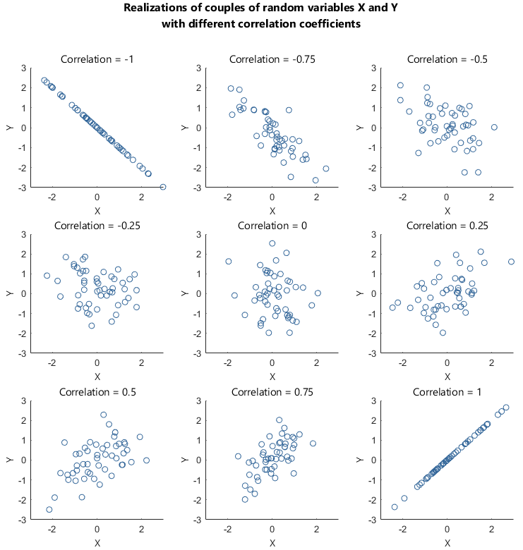
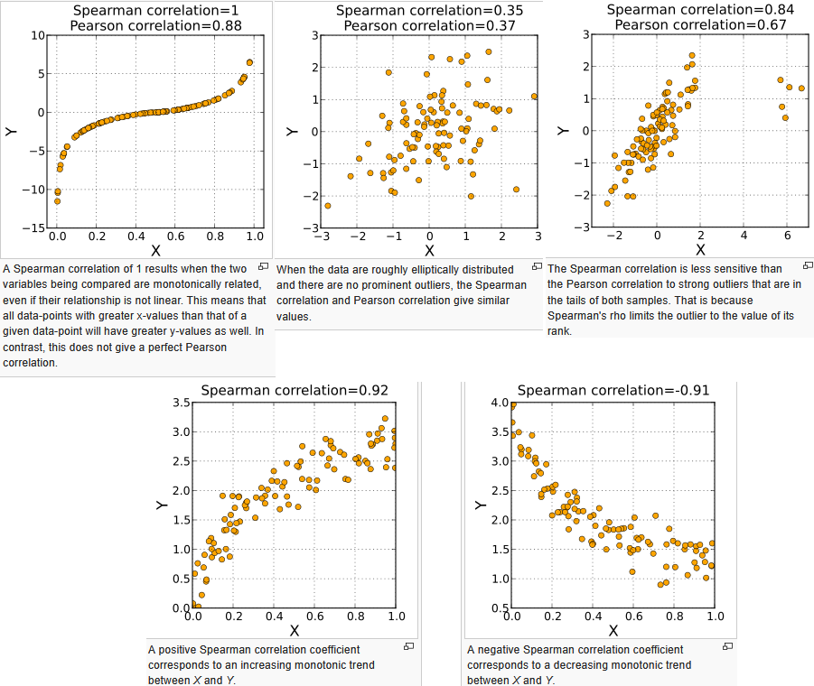
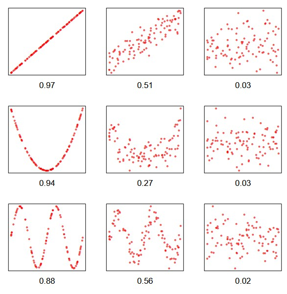

# Correlation Coefficients

## Table of Contents

- [Pearson Correlation](#pearson-correlation)
- [Spearman Correlation](#spearman-correlation)
- [Kendall Correlation](#kendall-correlation)
- [Maximal Information Coefficient](#maximal-information-coefficient)
- [Xi Coefficient](#xi-coefficient)

---

## What it is
Correlation measures the **strength and direction of a relationship** between two variables.

---

## Classical correlation measures

### Pearson Correlation
- **Idea:** measures linear dependence using covariance
- **Range:** [-1, 1]
- **Interpretation:**
  - 1 → perfect positive linear
  - 0 → no linear relationship
  - -1 → perfect negative linear
- **Use:** linear models, normally distributed data  
- **Pros:** simple, interpretable, widely used  
- **Cons:** sensitive to outliers, fails for nonlinear patterns  

---

### Spearman Correlation
- **Idea:** Pearson correlation applied to ranked data
- **Range:** [-1, 1]
- **Interpretation:** measures strength of **monotonic relationships**
- **Use:** nonlinear but monotonic relationships  
- **Pros:** robust to outliers, captures monotonicity  
- **Cons:** ignores exact functional form  

---

### Kendall Correlation
- **Idea:** compares concordant vs discordant pairs
- **Range:** [-1, 1]
- **Interpretation:** probability of agreement in ordering  
- **Use:** small datasets, ordinal data  
- **Pros:** robust, statistically well-grounded  
- **Cons:** lower power for large datasets  

---

## Key limitation
Correlation fails for **nonlinear, non-monotonic relationships** (e.g. U-shape)  
→ **Low correlation ≠ independence**

### Example (Pearson vs Spearman)

---

## Advanced dependence measures

### Maximal Information Coefficient
- **Idea:** detects relationships via mutual information maximization  
- **Range:** [0, 1]  
- **Interpretation:** higher values → stronger (possibly nonlinear) dependence  
- **Use:** exploratory data analysis, feature discovery  
- **Pros:** captures wide range of relationships  
- **Cons:** computationally expensive, less interpretable, sample-size sensitive  

---

### Chatterjee’s Xi Coefficient (ξ)
- **Idea:** measures dependence via predictability of ordering (Chatterjee, 2021)  
- **Range:** [0, 1]  
- **Interpretation:**
  - ξ = 0 → independence  
  - ξ → 1 → strong dependence (not necessarily monotonic)  
- **Use:** detecting general dependence when structure is unknown  
- **Pros:** captures broad dependencies, simple scalar summary  
- **Cons:** limited interpretability, sensitive to noise, **directional**  

---

## Quick comparison

| Method   | Captures                 |
|----------|--------------------------|
| Pearson  | Linear                   |
| Spearman | Monotonic                |
| Kendall  | Monotonic (robust)       |
| MIC      | Nonlinear                |
| ξ (Chatterjee) | General dependence |

---

## Limitations and considerations

No single dependence measure is universally optimal:

- **Interpretability trade-off:**  
  Advanced methods (MIC, ξ) detect more patterns but explain less about *how* variables relate  

- **Noise sensitivity:**  
  All measures degrade with noisy or small datasets  

- **Model alignment:**  
  Choose the metric based on the **underlying relationship**  

- **Directionality (ξ):**  
  Chatterjee’s coefficient measures how one variable predicts the ordering of another:
  $ξ(X, Y) \neq ξ(Y, X)$
 
---

## Practical takeaway

- Use **Pearson** → when linearity is expected  
- Use **Spearman / Kendall** → for monotonic relationships  
- Use **MIC / ξ** → for exploratory detection of complex dependence  

→ Always match the method to the **data structure and goal of analysis**

---

## Notebook (interactive example)
- 📄 [Open notebook](../../notebooks/DS_correlations.ipynb) 
- ▶️ https://colab.research.google.com/github/harisdtu/dtu-data-science-handbook/blob/main/notebooks/DS_correlations.ipynb
